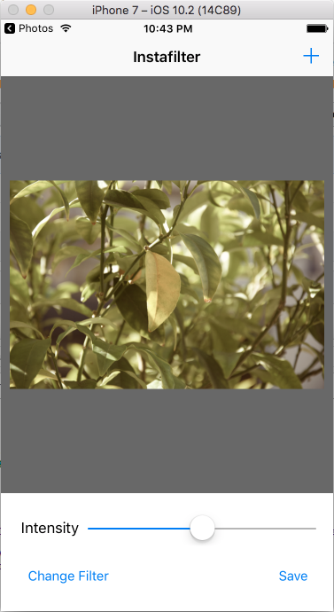
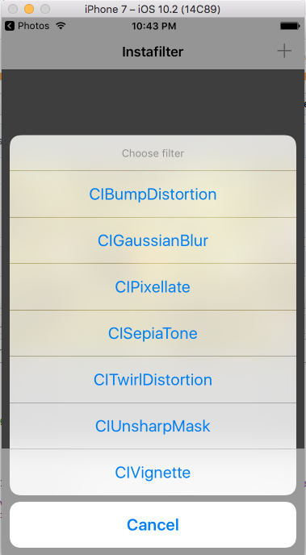
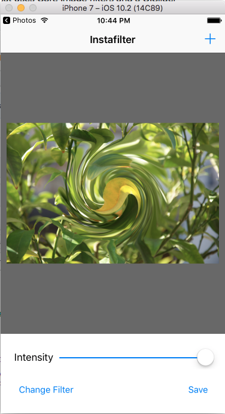
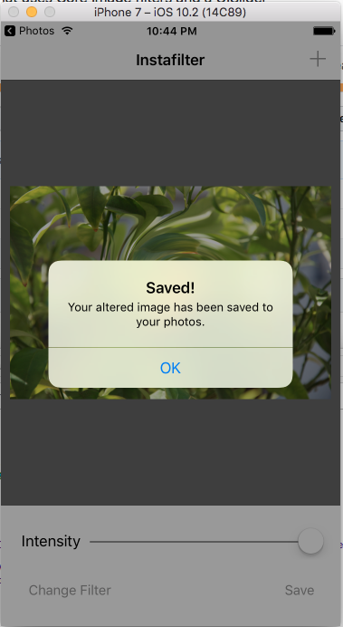
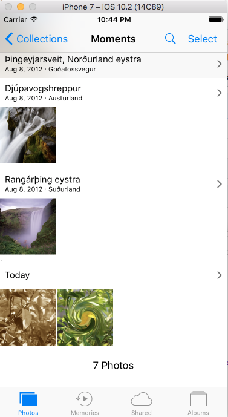

# Instafilter

This app allows a user to take an image from the photos app, apply a filter with varying intensity and then save the new image back into the photos app.

### Screenshot of the Instafilter App

                         Above: Screenshot of the Instafilter app showing an image being added

                         Above: Screenshot of the Instafilter app showing the filters action sheet
                         
 

                         Above: Screenshot of the Instafilter app showing a filter being applied                   

 

                         Above: Screenshot of the Instafilter app showing that the image was saved in the Photos app

 

                         Above: Screenshot of the Photos app demonstrating that the image was indeed saved
                        

Code Source: Hacking with Swift - https://www.hackingwithswift.com
